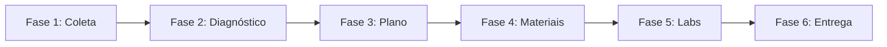

# 🎓 Gerador de Kits de Estudo para Certificações

> **Gere kits de estudo completos, personalizados e otimizados para iniciantes em QUALQUER certificação técnica em minutos usando agentes de IA**

[](https://opensource.org/licenses/MIT)
[](https://github.com/features/copilot)
[](TEMPLATE.md)

---

## ⚠️ Aviso Importante

**Este material é um COMPLEMENTO aos recursos oficiais de estudo**, não uma fonte única ou substituta. O kit gerado organiza e estrutura o conteúdo das documentações oficiais dos vendors (Microsoft Learn, AWS Docs, Kubernetes.io, etc.) para facilitar seu aprendizado.

**Recomendações:**
- ✅ Use este kit JUNTO com os módulos oficiais de treinamento
- ✅ Consulte sempre a documentação oficial atualizada
- ✅ Pratique em ambientes reais (Azure Portal, AWS Console, etc.)
- ✅ Faça os simulados oficiais do vendor (quando disponíveis)
- ❌ Não confie apenas neste material para aprovação no exame
- ❌ Não substitua a prática hands-on por leitura passiva

**Este projeto existe para ORGANIZAR conhecimento público, não para criá-lo.**

---

## 📋 Requisitos para Executar

> ⚠️ **Ambiente oficialmente suportado:** este template foi **criado, refinado e testado exclusivamente no GitHub Copilot (Agent Mode) dentro do VS Code**, usando os MCPs oficiais dos vendors (`microsoft.docs.mcp`, `Azure MCP`, `github` MCP).

### ✅ Configuração recomendada (testada e validada)

| Item | Versão / Detalhe |
|---|---|
| **Editor** | [VS Code](https://code.visualstudio.com/) (estável, versão atual) |
| **Extensão** | [GitHub Copilot](https://marketplace.visualstudio.com/items?itemName=GitHub.copilot) + [GitHub Copilot Chat](https://marketplace.visualstudio.com/items?itemName=GitHub.copilot-chat) |
| **Modo** | **Agent Mode** (não use Ask/Edit Mode — o template precisa criar dezenas de arquivos) |
| **Plano** | GitHub Copilot Pro, Business ou Enterprise (Free pode ter limites de mensagens insuficientes) |
| **Modelo LLM** | Claude Sonnet 4.5 ou GPT-5 (qualquer modelo com janela ≥128k e bom tool calling) |
| **Permissões** | Habilitar uso de **tools/MCP** quando o agente solicitar |
| **Internet** | Necessária durante a geração (consultas MCP às docs oficiais) |
| **Espaço em disco** | ~1-2 MB por kit gerado |

### ⚠️ Outros agentes/IDEs (Cursor, Windsurf, Cline, Claude Desktop, ChatGPT, etc.)

**Não foram testados.** O template **pode** funcionar nessas plataformas se elas suportarem:
- ✅ Criação de múltiplos arquivos no workspace
- ✅ Tool use / function calling
- ✅ Acesso a MCPs ou navegação web (`fetch`) para validar docs oficiais
- ✅ Janela de contexto ≥128k tokens

Mas **não há garantia** de que o resultado seja equivalente: você pode ver arquivos faltando, links inválidos, conteúdo truncado ou alucinações de sintaxe. Se for o seu caso, **use por sua conta e risco** e valide manualmente o material gerado contra a documentação oficial do vendor.

> 💡 **Por que GitHub Copilot?** É o ambiente onde o template foi iterado dezenas de vezes; a interação Agent Mode + MCPs oficiais Microsoft/GitHub + criação direta de arquivos no workspace é exatamente o que o prompt assume.

---

## 🚀 O que é isso?

Este é um **template de prompt reutilizável** projetado para o **GitHub Copilot (Agent Mode) no VS Code**, que o transforma no seu gerador pessoal de kits de estudo para certificações. Em **uma única conversa**, você obtém:

- 📋 **Avaliação diagnóstica** (20-25 questões) para calibrar seu nível real
- 📚 **Material de estudo completo** para todos os domínios do exame
- 🧪 **Labs práticos** (modo dual: guiado 30-60min + speedrun 10-20min)
- 🎴 **Flashcards** (TOP 50 perguntas + export CSV compatível com Anki)
- 🎯 **Simulado interativo** (quiz HTML completo com cronômetro)
- 📝 **Template de rastreamento de erros** + checklist de progresso
- 📖 **Glossário** (40-80 termos) + **Mapas conceituais** (diagramas Mermaid)
- 🗓️ **Plano de estudos personalizado** adaptado ao SEU tempo, nível e fraquezas

Todo o conteúdo é **100% baseado em documentação oficial dos vendors** (Microsoft Learn, GitHub Docs, AWS Docs, etc.) — **zero cursos de terceiros, dumps ou recursos pagos**.

---

## 🎯 Por Que Usar Isso?

### ✅ Para Estudantes
- **Economize 20-40 horas** de curadoria e organização de conteúdo
- **Otimizado para iniciantes** (v3) com calibração diagnóstica
- **Open-source** e **gratuito para sempre** (Licença MIT)
- **Funciona offline** (simulador HTML, arquivos markdown)
- **Multi-idioma** (gere em qualquer idioma: português, inglês, espanhol, etc.)

### ✅ Para Criadores/Educadores
- **Reprodutível** — mesmo prompt gera qualidade consistente
- **Adaptável** — modifique o template para seu estilo de ensino
- **Orientado à comunidade** — compartilhe melhorias via PRs
- **Ético** — força uso apenas de fontes oficiais

---

## 📦 O Que é Gerado?

Quando você executa este template, obtém **30-35 arquivos** incluindo:

### 📋 Materiais de Estudo Principais (13 arquivos)
- `README.md` - Hub com setup, roadmap e checklist
- `diagnostic.md` - 20-25 questões de calibração (Dia 0 obrigatório)
- `fundamentals.md` - Primer de pré-requisitos (para iniciantes)
- `glossary.md` - Termos técnicos A-Z
- `concept-map.md` - Diagramas de relacionamento Mermaid
- `study-plan.md` - Cronograma dia-a-dia personalizado
- `cheatsheet.md` - Tabelas de referência rápida
- `pegadinhas.md` - TOP 20 armadilhas do exame + heurísticas de decisão
- `exam-strategy.md` - Estratégia de 3 passes + gestão de tempo
- `mock-exam-plan.md` - Cronograma de simulados
- `simulado.html` - **Quiz interativo em arquivo único** (sem build!)
- `flashcards.md` + `flashcards.csv` - TOP 50 Q&A para repetição espaçada
- `mistake-log.md` - Template de rastreamento de erros

### 📚 Guias por Domínio (5+ arquivos)
- `domains/01-topico.md` → `domains/05-topico.md`
- Cada um cobre 1 domínio do exame com exemplos, comandos, comparações

### 🧪 Labs Práticos (3-5 labs, cada um com 4+ arquivos)
- `labs/01-nome/README-guided.md` - Modo didático (30-60min)
- `labs/01-nome/README-speedrun.md` - Modo retenção (10-20min)
- `labs/01-nome/<arquivos-codigo>` - Scripts executáveis Python/JS/Shell
- `labs/01-nome/requirements.txt` - Dependências

**Estrutura de exemplo:**
```
az-204/
├── README.md
├── diagnostic.md
├── fundamentals.md
├── glossary.md
├── concept-map.md
├── study-plan.md
├── cheatsheet.md
├── simulado.html ⭐
├── flashcards.md + .csv
├── domains/
│   ├── 01-compute.md
│   ├── 02-storage.md
│   └── ...
└── labs/
    ├── 01-container-app/
    │   ├── README-guided.md
    │   ├── README-speedrun.md
    │   ├── app.py
    │   └── Dockerfile
    └── ...
```

---

## 🚀 Início Rápido (3 passos)

### 1️⃣ **Abra o Template**
- Baixe o [`TEMPLATE.md`](TEMPLATE.md) deste repositório
- Ou copie o prompt diretamente do [arquivo raw](https://raw.githubusercontent.com/YOUR-USERNAME/certification-kit-generator/main/TEMPLATE.md)

### 2️⃣ **Preencha Suas Variáveis**

Você só precisa de **5 variáveis obrigatórias** — o agente descobre o resto.

#### ✅ Obrigatórias (você preenche)

```markdown
<<EXAM_CODE>>           = AZ-204         # código oficial do exame
<<DAYS_AVAILABLE>>      = 15             # dias até o exame (ou "flexível")
<<HOURS_PER_DAY>>       = 2              # horas de estudo por dia
<<EXPERIENCE_LEVEL>>    = iniciante      # iniciante absoluto | iniciante com base | intermediário
<<PREFERRED_LANGUAGE>>  = pt-BR          # pt-BR | en-US | es-ES | ...
```

#### 🟡 Opcionais (têm padrão sensato; preencha se souber)

```markdown
<<EXAM_DATE>>      = 2026-06-15    # padrão: "não marcada"
<<PRIOR_CERTS>>    = AZ-900        # padrão: "nenhuma"
<<STRONG_AREAS>>   = redes, infra  # padrão: "desconhecido" (diagnóstico calibra)
<<WEAK_AREAS>>     = segurança     # padrão: "desconhecido" (diagnóstico calibra)
<<NOTE_TOOL>>      = Notion        # padrão: "nenhum"
```

#### 🤖 Auto-derivadas (o agente descobre — **iniciante NÃO precisa saber**)

`<<EXAM_NAME>>`, `<<EXAM_VENDOR>>`, `<<OFFICIAL_DOCS_DOMAIN>>` e `<<VENDOR_LEARNING_PLATFORM>>` são resolvidos automaticamente pelo agente a partir do `<<EXAM_CODE>>`, consultando fontes oficiais via MCP. Você pode deixar esses campos como estão no template.

### 3️⃣ **Execute em um Agente de IA**
- Abra um **workspace vazio** no VS Code
- Abra o **GitHub Copilot Chat** (ou seu agente de IA)
- **Cole o template preenchido** e pressione Enter
- Aguarde 5-15 minutos ⏱️
- Pronto! 🎉

---

## 🌍 Certificações Suportadas

Este template funciona para **qualquer certificação técnica baseada em texto** com documentação oficial:

### ☁️ Provedores de Nuvem
- **Microsoft Azure**: AZ-900, AZ-104, AZ-204, AZ-305, AZ-500, ...
- **AWS**: Cloud Practitioner, Solutions Architect, Developer, ...
- **Google Cloud**: Exames Associate/Professional

### 🛠️ DevOps & Infraestrutura
- **Kubernetes**: CKA, CKAD, CKS (CNCF)
- **HashiCorp**: Terraform Associate/Professional, Vault, ...
- **Linux Foundation**: LFCS, LFCE

### 🔧 Específicas de Plataforma
- **GitHub**: GitHub Foundations, GitHub Actions, GitHub Admin
- **Docker**: Docker Certified Associate
- **Red Hat**: RHCSA, RHCE

### 📊 Outras
- **Bancos de Dados**: MongoDB, PostgreSQL, ...
- **Segurança**: CompTIA Security+, CISSP (se houver docs)
- **Programação**: Certificações específicas de linguagens (se houver docs oficiais)

**Requisitos:**
- ✅ Vendor tem documentação oficial (ex: `learn.microsoft.com`, `docs.aws.amazon.com`)
- ✅ Vendor tem plataforma oficial de aprendizagem (ex: Microsoft Learn, AWS Training)
- ❌ NÃO funciona para certificações sem docs oficiais (precisaria de fontes de terceiros)

---

## ⚙️ Como Funciona?

### 🧠 Arquitetura do Template

O prompt é dividido em **6 fases** executadas sequencialmente:



1. **Coleta de Dados do Exame** — Busca estatísticas oficiais, domínios, % de peso
2. **Calibração Diagnóstica** — 20-25 questões para identificar lacunas
3. **Planejamento do Cronograma** — Algoritmo de distribuição baseado em tempo disponível
4. **Geração de Materiais** — Flashcards, glossário, cheatsheet, simulado HTML
5. **Labs Práticos** — Scaffolding de código executável com modo dual
6. **Validação e Entrega** — Checklist de qualidade + índice navegável

### 🔒 Salvaguardas de Qualidade

O template impõe:

- ✅ **Fontes Oficiais Obrigatórias** — Apenas documentação do vendor (Microsoft Learn, GitHub Docs, AWS Docs, etc.)
- ❌ **Zero Recursos de Terceiros** — O template valida e rejeita fontes não-oficiais
- 🔎 **Validação de Links** — Todos os links devem apontar para o domínio oficial
- 📊 **Calibração de Dificuldade** — Diagnóstico identifica o nível do estudante antes de gerar conteúdo
- 🎯 **Alinhamento aos Objetivos do Exame** — Cada arquivo mapeia para domínios oficiais

### 🛠️ Requisitos Técnicos (resumo)

> Veja a [seção completa de Requisitos](#-requisitos-para-executar) no topo do README para detalhes.

- **Agente de IA**: **GitHub Copilot em Agent Mode** (oficialmente testado). Outras plataformas não foram validadas.
- **Editor**: VS Code (recomendado pela integração nativa com Copilot e MCPs)
- **Espaço**: ~1-2 MB por kit gerado
- **Conectividade**: Necessária durante a geração (para query das docs oficiais via MCP)

### 🧠 Modelos de LLM Recomendados

A geração de um kit completo exige **raciocínio longo**, **chamadas a ferramentas/MCP** e **janela de contexto ampla**. Use modelos da geração mais recente com pelo menos **128k de contexto**:

| Provedor | Modelo recomendado | Por quê |
|---|---|---|
| **GitHub Copilot** | Claude Sonnet 4.5 (ou superior) / GPT-5 | Excelente seguimento de instruções longas, uso nativo de MCP no VS Code |
| **Anthropic** | Claude Sonnet 4.5 / Opus 4.x | Forte em raciocínio estruturado e geração de arquivos longos |
| **OpenAI** | GPT-5 / GPT-4.1 (long context) | Bom desempenho com janela ampla e tool calling |
| **Google** | Gemini 2.5 Pro | Janela de contexto muito ampla, útil em certificações grandes |

> ⚠️ **Evite** modelos pequenos/rápidos (ex: `mini`, `flash`, `haiku`) para a primeira execução: eles podem truncar conteúdo, pular arquivos ou alucinar links. Use-os apenas para iterações pontuais depois.

### 💰 Estimativa de Consumo de Tokens

A geração de um kit completo é **token-intensiva**. Valores aproximados por execução:

| Tamanho da certificação | Exemplos | Tokens de entrada | Tokens de saída | Total estimado |
|---|---|---:|---:|---:|
| **Pequena** | GH-Foundations, AZ-900, AWS-CLF | ~30-50k | ~80-120k | **~110-170k** |
| **Média** | AZ-204, AWS-SAA, CKAD, TF-Associate | ~50-90k | ~150-250k | **~200-340k** |
| **Grande** | AZ-305, AWS-SAP, CKA+CKS combinados | ~80-150k | ~250-400k | **~330-550k** |

**Os números variam conforme:**
- 📐 **Tamanho/complexidade do exame** — mais domínios e serviços = mais conteúdo
- 🌍 **Idioma** — `pt-BR`/`es-ES` consomem ~15-25% mais tokens que `en-US` por byte
- 🧪 **Profundidade dos labs** — labs com código completo aumentam a saída
- 🔍 **Chamadas MCP/fetch** — validação de cada link oficial gera entrada adicional
- 🔁 **Retries/correções** — se o agente refazer arquivos, o consumo dobra

**Dicas para reduzir custo:**
- Use GitHub Copilot (incluso na sua assinatura) em vez de API direta paga
- Comece com certificações menores para calibrar o template à sua conta
- Se interrompido, peça ao agente para **continuar** em vez de regerar do zero

---

## 🔒 Ética e Regras de Fontes

Este template **impõe padrões éticos rigorosos**:

### ✅ Fontes Permitidas (Obrigatórias)
- Documentação oficial do vendor (ex: `learn.microsoft.com`, `docs.aws.amazon.com`)
- Plataformas de aprendizagem oficiais do vendor (ex: Microsoft Learn, AWS Training)
- Repositórios oficiais do vendor (ex: `github.com/microsoft/`)

### ❌ Fontes Proibidas (Regras Codificadas)
- ❌ Cursos pagos de terceiros
- ❌ Cursos gratuitos de terceiros (vídeos, blogs, artigos)
- ❌ "Exam dumps" ou bancos de questões vazadas
- ❌ Bancos de questões da comunidade (a menos que oficialmente endossados pelo vendor)
- ❌ Agregadores ou wikis não-oficiais

### Por Que Isso Importa
1. **Integridade** — Sem trapaças, sem atalhos que violem os termos do vendor
2. **Qualidade** — Docs oficiais são mantidos atualizados pelos vendors
3. **Confiança** — Você pode compartilhar seu kit gerado publicamente sem preocupações
4. **Complemento** — Este material complementa as fontes oficiais, não as substitui

**O template valida explicitamente as fontes** e apresentará erro se você tentar adicionar links de terceiros.

---

## 🛠️ Personalização

### Para Educadores
Faça fork do template e adicione suas próprias seções:
- Adicione `notas-pedagogicas.md` com dicas de ensino
- Adicione `plano-sala-aula.md` para treinamento presencial
- Adicione pasta `projetos-grupo/` para labs em equipe

### Para Empresas
- Adicione `contexto-empresa.md` com casos de uso internos
- Adicione `labs-avancados/` para cenários de produção
- Customize `study-plan.md` para trilhas de aprendizagem em equipe

### Para Falantes de Outros Idiomas
- Configure `<<PREFERRED_LANGUAGE>>` para seu código de idioma
- Todo o conteúdo gerado estará nesse idioma
- Termos técnicos permanecem em inglês (como aparecem nos exames)

---

## 🤝 Contribuindo

Aceitamos contribuições! Veja como:

1. **Reporte problemas** — Encontrou um bug ou instrução confusa? [Abra uma issue](https://github.com/YOUR-USERNAME/certification-kit-generator/issues)
2. **Melhore o template** — Prompts melhores, novos recursos? Envie um PR
3. **Traduza** — Quer o README em outro idioma? PRs são bem-vindos!

Veja [CONTRIBUTING.md](CONTRIBUTING.md) para diretrizes detalhadas.

---

## 📊 Estatísticas

- **Versão do Template:** v3 (Maio 2026)
- **Arquivos Gerados:** 30-35 por kit
- **Conteúdo Médio:** 50.000-70.000 palavras
- **Tempo de Geração:** 5-15 minutos
- **Custo:** Gratuito (apenas uso do agente de IA)
- **Licença:** MIT (use em qualquer lugar, modifique livremente)

---

## 📜 Licença

Este projeto é **open-source** sob a [Licença MIT](LICENSE).

Você pode:
- ✅ Usar comercialmente (gerar kits para cursos pagos)
- ✅ Modificar e distribuir
- ✅ Usar privadamente
- ❌ Responsabilizar o autor (use por sua conta e risco)

---

## 🎯 Resumo (TL;DR)

1. Baixe o [`TEMPLATE.md`](TEMPLATE.md)
2. Preencha apenas **5 variáveis obrigatórias** (código do exame, dias, horas/dia, nível, idioma) — o agente descobre o resto
3. Cole no GitHub Copilot (workspace vazio)
4. Obtenha **30-35 arquivos** de materiais de estudo personalizados em 10 minutos
5. Estude, passe no exame, sucesso! 🎉

**Sem cursos pagos, sem dumps, sem enrolação.** Apenas você, docs oficiais e um template inteligente.

---

**⭐ Se isso ajudou você, por favor dê uma estrela no repositório!** Isso ajuda outras pessoas a descobrirem o projeto.

**💙 Bons estudos!** Que suas certificações se multipliquem e seu conhecimento cresça. 🚀📚
